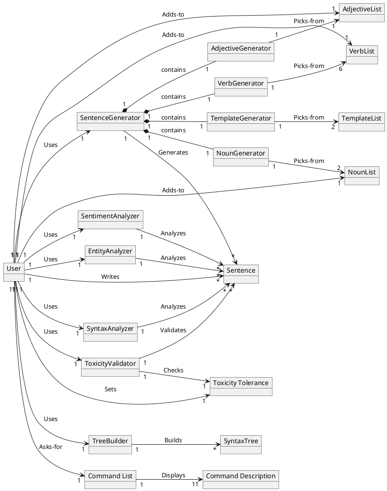

# Domain Model

# Notes
* The given domain model is a showcase of the program's features and as such doesn't include commands as the "default" or "personalized" ones, as those are routines that implement a combination of the other represented commands. 
* All generated sentences, analyses and syntax trees are displayed on screen and viewable by the user once created, this is not represented in the domain model as it is considered implicit and grants a more clear and understandable graph.
* The program also grants a log and a command to display log entries on console, this is not represented in the graph as this feature is aimed at developers and mainly used for debugging, which does not interest the average stakeholder.
