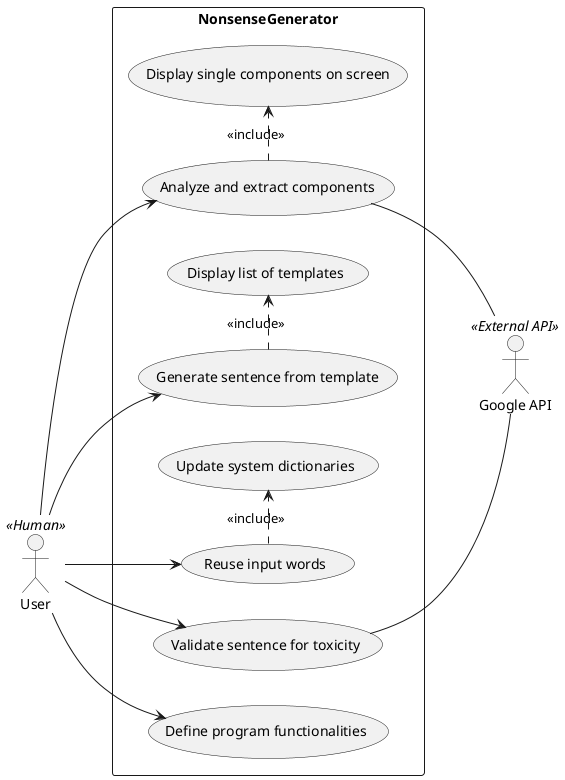

## Use Cases
1. Analyze and extract sentence components
2. Generate a nonsense sentence from a template
3. Validate a generated sentence for toxicity
4. Reuse user input words by updating dictionaries
5. Define the functionalities of the program

# Use Case tables

| Use Case name      | Analyze and extract sentence components                                                                                     |
|--------------------|-----------------------------------------------------------------------------------------------------------------------------|
| Actors             | User                                                                                                                        |
| Description        | The user inputs a sentence and the system divides  the sentence components into nouns, verbs and adjectives and lists them  |
| Preconditions      | The user writes a sentence as an input                                                                                      |
| Main Scenario      | The system parses the sentence, extracts nouns, verbs and adjectives                                                        |
| Alternate Scenario | \-                                                                                                                          |
| Post\-Conditions   | The output is displayed on screen                                                                                           |
| Notes              | \-                                                                                                                          |

| Use Case name      | Generate a nonsense sentence from a template                                                                                              |
|--------------------|-------------------------------------------------------------------------------------------------------------------------------------------|
| Actors             | User                                                                                                                                      |
| Description        | The user picks a template from a selection given by the system, which proceeds to generate a nonsense sentence using the choosen template |
| Preconditions      | The system grants a number of templates                                                                                                   |
| Main Scenario      | The system generates a sentence based on the chosen template                                                                              |
| Alternate Scenario | \-                                                                                                                                        |
| Post\-Conditions   | The generated sentence is displayed on screen                                                                                             |
| Notes              | \-                                                                                                                                        |

| Use Case name      | Validate generated sentence for toxicity                                                                                                                            |
|--------------------|---------------------------------------------------------------------------------------------------------------------------------------------------------------------|
| Actors             | User                                                                                                                                                                |
| Description        | The system evaluates the toxicity of a generated sentence using the moderation API, returns the respective scores and defines the sentence to be appropriate or not |
| Preconditions      | A sentence must be previously generated                                                                                                                             |
| Main Scenario      | The system validates the generated sentence using the toxicity scores given by the moderation API                                                                   |
| Alternate Scenario | \-                                                                                                                                                                  |
| Post\-Conditions   | The sentence is defined as appropriate or inappropriate                                                                                                             |
| Notes              | \-                                                                                                                                                                  |

| Use Case name      | Reuse user input words by updating dictionaries                                                                                                  |
|--------------------|--------------------------------------------------------------------------------------------------------------------------------------------------|
| Actors             | User                                                                                                                                             |
| Description        | The user inputs a sentence, its words are selected and put into the system's lists of nouns, adjectives or verbs, for the system to use later on |
| Preconditions      | The user writes a sentence as an input                                                                                                           |
| Main Scenario      | The words of the sentence are stored in each respective list                                                                                     |
| Alternate Scenario | \-                                                                                                                                               |
| Post\-Conditions   | When generating a nonsense sentence later on, the given words can be used                                                                        |
| Notes              | \-                                                                                                                                               |

| Use Case name      | Define the functionalities of the program                                                                            |
|--------------------|----------------------------------------------------------------------------------------------------------------------|
| Actors             | User                                                                                                                 |
| Description        | The system grants a list of commands the user can choose, with a detailed description of each function               |
| Preconditions      | \-                                                                                                                   |
| Main Scenario      | When starting the program, a list of commands is displayed with a description                                        |
| Alternate Scenario | The user can input the "help" or "info" command to be granted information at any given time during program execution |
| Post\-Conditions   | A list and description of commands is displayed on screen                                                            |
| Notes              | Both a "help" and "info" command are granted, as the second one grants a more accurate description                   |

# Use Cases Diagram

