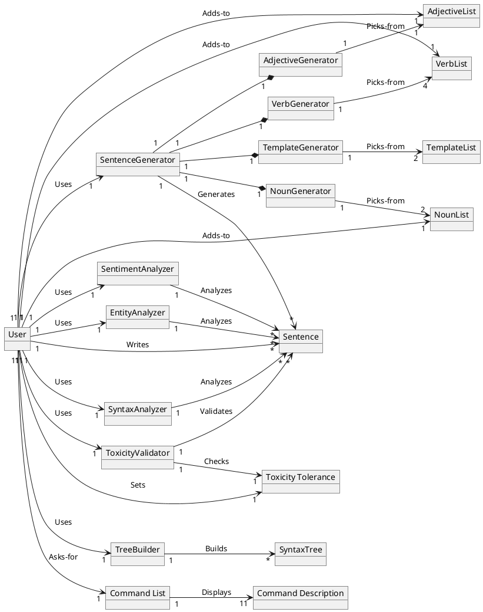

# Domain Model

```plantuml
@startuml
left to right direction
object "User" as U

object "Sentence" as S

object "SentenceGenerator" as Sgen
object "TemplateGenerator" as Tgen
object "NounGenerator" as Ngen
object "VerbGenerator" as Vgen
object "AdjectiveGenerator" as Agen

object "ToxicityValidator" as ToxA
object "SyntaxAnalyzer" as SynA
object "SentimentAnalyzer" as SenA
object "EntityAnalyzer" as EntA

object "TreeBuilder" as TB
object "SyntaxTree" as SynT

object "Toxicity Tolerance" as Tol

object "TemplateList" as Tlist
object "NounList" as Nlist
object "AdjectiveList" as Alist
object "VerbList" as Vlist

Object "Command List" as CL
object "Command Description" as CD

U "1"--> "*"S : Writes

U "1"--> "1"Sgen : Uses
Sgen "1"--* "1"Tgen
Sgen "1"--* "1"Ngen
Sgen "1"--* "1"Vgen
Sgen "1"--* "1"Agen
Sgen "1"--> "*"S: Generates

U "1"--> "1"ToxA: Uses
ToxA "1"--> "*"S: Validates
U "1"--> "1"Tol: Sets
ToxA "1"--> "1"Tol: Checks
U"1" -->"1" SynA: Uses
U"1" -->"1" SenA: Uses
U"1" -->"1" EntA: Uses
SynA"1" -->"*" S: Analyzes
SenA"1" -->"*" S: Analyzes
EntA"1" -->"*" S: Analyzes

U"1" --> "1"TB: Uses
TB"1" --> "*"SynT: Builds

Tgen "1"--> "2"Tlist: Picks-from
Vgen "1"--> "4"Vlist: Picks-from
Ngen "1"--> "2"Nlist: Picks-from
Agen "1"--> "1"Alist: Picks-from

U"1" --> "1"Vlist: Adds-to
U"1" --> "1"Nlist: Adds-to
U"1" --> "1"Alist: Adds-to

U"1" --> "1"CL: Asks-for
CL"1" --> "11"CD: Displays


@enduml
```
